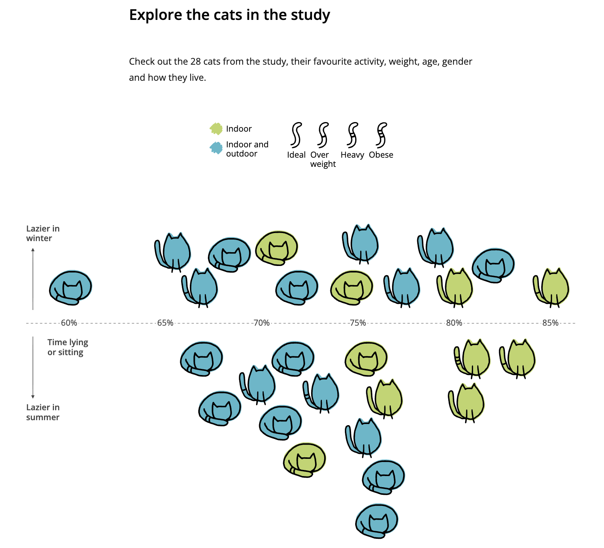
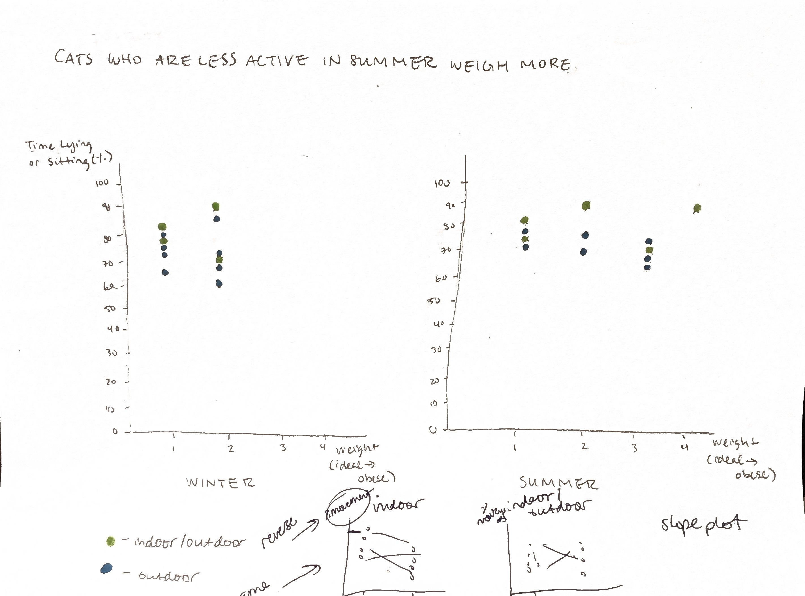

| [home page](https://cmustudent.github.io/tswd-portfolio-templates/) | [data viz examples](dataviz-examples) | [critique by design](critique-by-design) | [final project I](final-project-part-one) | [final project II](final-project-part-two) | [final project III](final-project-part-three) |

# Critique and Redesign

## Original Visualization
For my visualization redesign, I decided to attempt to create a more readable version of the illustrated chart called “Explore the Cats in This Study” from the article “Lazy Cats: Do cats really loaf all day? A visual investigation into feline laziness” (https://lazy-cats.netlify.app/), which explores data from the paper “How Lazy Are Pet Cats Really? Using Machine Learning and Accelerometry to Get a Glimpse into the Behaviour of Privately Owned Cats in Different Households.” I found this visualization to be very playful and fun, fitting for the subject matter—it has a hand-drawn look and uses cat icons instead of more standard shapes and graphics. However, while I was interested in the subject matter (a look at all 28 cats who participated in the study, and their level of activity/laziness), I found that the longer I tried to make sense of the chart, the more confused I became. 

The chart includes 4 variables: cat housing status (indoor/indoor-outdoor), weight (ideal, overweight, heavy, or obese), their percent of time “lying or sitting,” and whether the cats are “lazier in winter” or “lazier in summer.” The cats’ weight is indicated via tick marks on the icons’ tails, which might require some squinting to see. The cat icons are also showing either sitting or lying down, which is unexplained in the graph; presumably this represents each cat’s “favorite” activity, but it’s unclear. The subheading also implies that the chart should show us age and gender as well, but that’s not indicated visually—and if it was, it would only further overwhelm an already overly complicated visualization. 

## First Draft & Critique
My initial idea was to create two side-by-side charts by season, and to use a bubble chart to indicate the larger cats with larger bubbles. I quickly realized that my idea couldn’t work since that would only leave one numbered variable (% of time lying/sitting)—what could the other axis represent? Trying again, I decided to create a scatter plot and with weight on the x-axis and activity on the y-axis, hoping to reveal some sort of trend. My problem then was that weight was not a continuous variable, so most of the cat participants simply stacked on top of each other on the graph. Another issue came about when I realized that the original chart was not showing the same cats in both winter and summer, but rather which cats were “lazier” in each season, and then sorting accordingly. So in the end, my first draft of a reimagined graph was not showing a comparison between seasonal activity level after all, and the stacked “scatter plot” was hard to follow.

My classmates felt similarly stumped as we looked more closely at the original visualization and what “story” could be drawn from it–as well as which variables might not be necessary. At first we talked about continuing to separate the data by cat weight, but after some discussion, we decided that a true seasonal comparison between cat activity, as well as their housing status, might bring more interesting conclusions. With that decision, we decided it would be ok to remove the weight variable since it would most likely only distract from the other information in the visualization. I couldn’t figure out the best way to show a change over time while still showing the 28 individual participants like the original graph, and it was suggested I try to create a slope chart. This felt like the best solution to me.

## First Redesign: Slope Chart
Taking my classmates’ advice, I used Tableau to create a slope chart to see if I could depict a change in cats’ level of activity between season, based on their housing status. This would maintain the original graph’s goal of showing all cat participants at once, but I hypothesized that it would help readers (like me) draw more immediate conclusions about the data. I decided to invert the activity level variable so that my chart would show percent of active time rather than percent of time lying/sitting so that a higher placement on the chart wouldn’t be misleading. I maintained the original colors to indicate housing status, and I added a more descriptive title highlighting the results. 

<noscript></noscript><object class='tableauViz'  style='display:none;'><param name='host_url' value='https%3A%2F%2Fpublic.tableau.com%2F' /> <param name='embed_code_version' value='3' /> <param name='site_root' value='' /><param name='name' value='Cat_Data_Charts&#47;Sheet3' /><param name='tabs' value='no' /><param name='toolbar' value='yes' /><param name='static_image' value='https:&#47;&#47;public.tableau.com&#47;static&#47;images&#47;Ca&#47;Cat_Data_Charts&#47;Sheet3&#47;1.png' /> <param name='animate_transition' value='yes' /><param name='display_static_image' value='yes' /><param name='display_spinner' value='yes' /><param name='display_overlay' value='yes' /><param name='display_count' value='yes' /><param name='language' value='en-US' /><param name='filter' value='publish=yes' /></object>
                

## Final Redesign: Bar Chart
I was happy with my original redesign as a way to preserve some of the original chart’s features, but the resulting chart was very crowded given that it contained 28 data points. It was still a bit difficult to draw immediate conclusions from the visuals. I decided the data would probably be easiest to interpret if viewed as an average rather than individual data points. With that in mind, I simplified to side-by-side bar charts. I think this is the clearest representation of the data, and it very easily shows the differences between indoor and indoor-outdoor cat levels of activity and how it differs by season. 

<noscript></noscript><object class='tableauViz'  style='display:none;'><param name='host_url' value='https%3A%2F%2Fpublic.tableau.com%2F' /> <param name='embed_code_version' value='3' /> <param name='site_root' value='' /><param name='name' value='Cat_Data_Chart_2&#47;Sheet1' /><param name='tabs' value='no' /><param name='toolbar' value='yes' /><param name='static_image' value='https:&#47;&#47;public.tableau.com&#47;static&#47;images&#47;Ca&#47;Cat_Data_Chart_2&#47;Sheet1&#47;1.png' /> <param name='animate_transition' value='yes' /><param name='display_static_image' value='yes' /><param name='display_spinner' value='yes' /><param name='display_overlay' value='yes' /><param name='display_count' value='yes' /><param name='language' value='en-US' /><param name='filter' value='publish=yes' /></object>
                

## References
Hornung, Lisa. "Lazy Cats: Do cats really loaf all day? A visual investigation into feline laziness." https://lazy-cats.netlify.app/

Smit, M.; Corner-Thomas, R.A.; Draganova, I.; Andrews, C.J.; Thomas, D.G. How Lazy Are Pet Cats Really? Using Machine Learning and Accelerometry to Get a Glimpse into the Behaviour of Privately Owned Cats in Different Households. Sensors 2024, 24, 2623. https://doi.org/10.3390/s24082623
