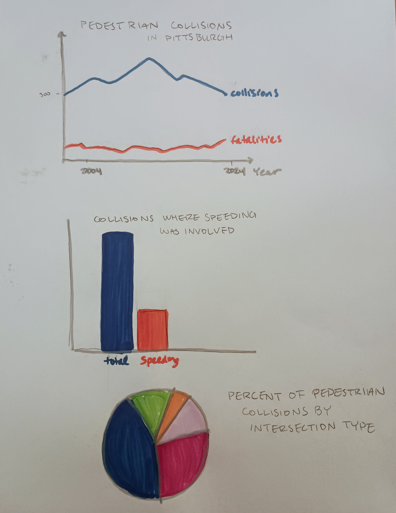

|[home page](https://ehoppoug.github.io/ehoppough-portfolio/)| [data viz examples](dataviz-examples) | [critique by design](critique-by-design) | [final project I](final-project-part-one) | [final project II](final-project-part-two) | [final project III](final-project-part-three) |

# Outline
The steps below outline my brainstorming process for the initial stages of my final project. To see how the project progressed, view [part II](final-project-part-two) and [part III](final-project-part-three).

## SETUP/LOW EMOTION: 
Crossing the street in Pittsburgh often feels unsafe, even with the right-of-way, as a pedestrian. Drivers often veer into crosswalks while taking left or right turns and don’t slow down. Every day I have to cross a 5-way intersection where a pedestrian was hit and killed just a few years ago—and I know exactly how: the left turn signal confusingly ushers cars through right before the walk sign turns on for pedestrians. How common are pedestrian collisions in this city/county, and is it possible that they could be avoided with better pedestrian markings or intersection signals? 

## CONFLICT/HIGH EMOTION
Pedestrian collisions and fatalities have decreased in Pittsburgh & Allegheny County over the past few years, possibly because of the city’s “Vision Zero” plan to develop safer streets. The city seems to be relatively similar to, or in some cases below, averages for cities of similar size.

## RESOLUTION/LOW EMOTION
Despite improvements in recent years, any number of pedestrian collisions and deaths should be seen as avoidable and preventable. My hypothesis is that available data will show that fewer collisions and deaths take place at intersections with markings and signals–however, I also want to look at speeding as a factor as well, since as I’ve already stated, I often see cars zooming through intersections regardless of safe street measures. Based on what I find from the data, I would like to make a call to action for the city of Pittsburgh to see the importance of effective traffic signals and/or speed reduction and to focus on these changes for the next few years of their Vision Zero strategy.

## Initial sketches

# The data
My main data source will be the “Cumulative Crash Data” from Western Pennsylvania Regional Data Center (https://data.wprdc.org/dataset/allegheny-county-crash-data/resource/2c13021f-74a9-4289-a1e5-fe0472c89881). This data set provides an extremely comprehensive view of collision records within Allegheny County from 2004–2024. This includes factors that are of interest to the “story” I’m hoping to tell, such as how many collisions involved pedestrians, how many resulted in a pedestrian death, how many involved speeding vehicles, and the intersection type and signal at each collision. With so many fields to pull from, and from 20 years of data, I think that I will be able to use this data set alone for the majority of my presentation. 

Additionally, however, I’m hoping that I can pull from other data related to crosswalks and pedestrian markings specifically. I would like to use data such as “City of Pittsburgh Intersection Markings” from data.gov (https://catalog.data.gov/dataset/city-of-pittsburgh-intersection-markings) to potentially see how intersection markings may or may not help prevent collisions with pedestrians within Pittsburgh and Allegheny County. It’s very likely that this comparison is too advanced for my current skillset (and the time we have left in the class), but I think it would make the most compelling argument for my story. 

# Method and medium
I plan to use Tableau to create visualizations, and Shorthand to display them along with relevant photos and statistics to tell a fuller story. 

## References
_List any references you used here._
